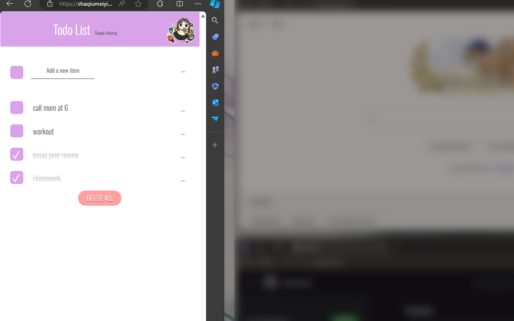

## Simple Todo-list
This is a very simple todo-list that makes you keep track of the todos. 

Todos that were added/deleted will be persistent, remaining on the page after the window being closed and reopened.

### Previous Version

The origin of this project was a desktop application named "dodolist," implemented by Java, which I adapted into a web application. 

Here is the link to the source code: [Dodo list](https://github.com/shaqiumeiying/Dodo-List)

